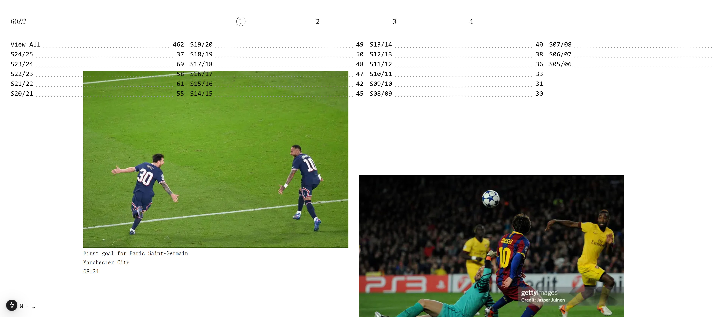

# GOAT

Listado de todos los goles en la carrera de Lionel Andrés Messi Cuccittini. Diseño por [https://taigatakahashi.com/](https://taigatakahashi.com/)

## Instalación

```bash
git clone https://github.com/brandonporcel/keep-code.git
cd keep-code
npm install
npm run dev
```

## TODO

- implementar datos de csv. usar papaparse
- transition views como [https://shu-gallery.vercel.app/](https://shu-gallery.vercel.app/)
- calendario
  - cuando cliquas un dia te aparece una lista de los goles que hizo messi en esa fecha
  - mapa de calor por cantidad
  - hacer 2 vistas, una con calendario y otra tipo listado[IMG] mostrando gol mas caractareistico de tal fecha hovereada
- hacer seccion mis goles favoritos
  - vs man city 2021
  - vs Málaga 2009
  - vs Uruguay 2012
  - vs chile 2012
  - Barcelona 3-1 Arsenal 2011: Messi 1st goal (1-0)
  - vs USA 2016
  - vs liverpool 2019
  - vs zaragoza 2010
  - solo Goal vs vs Real Madrid 2011
  - vs Real Betis 2019
  - vs atletico madrid 2011
- agregar formulario para que la gente ayude a mejorar los datos
  - hacer base de datos para guardar peticiones, backend con validaciones. un admin que confirme?
  - cada vez que alguien suba una imagen, un gol, etc, que mande un mail al admin para chequearlo.
    - user resend. hacer pantalla para visualizar tales peticiones?
- Si noto problemas de rendimiento con aprox 900 goles, chequear virtualización (con react-window o react-virtualized).
- responsive
- hacer pantalla de festejos?

### DATA

- stats for specific dates, like your bd!
  - [https://www.messistats.com/en/date/0/0/6/14/all/t/0/1](https://www.messistats.com/en/date/0/0/6/14/all/t/0/1)
- all club goals data
  - [https://www.kaggle.com/datasets/azminetoushikwasi/-lionel-messi-all-club-goals](https://www.kaggle.com/datasets/azminetoushikwasi/-lionel-messi-all-club-goals)
- all goals videos
  - [https://d2d6f098uopzs3.cloudfront.net/Goal2.mp4](https://d2d6f098uopzs3.cloudfront.net/Goal2.mp4)
  - [https://www.messiallgoals.com/](https://www.messiallgoals.com/)
- video con todos los goles
  - [https://www.youtube.com/watch?v=IscGtF_A14A](https://www.youtube.com/watch?v=IscGtF_A14A)

## Contribuciones

Las contribuciones son siempre bienvenidas. No dudes en enviar incidencias o pull requests.

## Feedback

Me encantaría leer tu opinion. Escribime por [mail](brandon7.7porcel@gmail.com) o [linkedin](https://www.linkedin.com/in/brandonporcel/])
